## 1
DBMS 是 **Database Management System**，中文叫**数据库管理系统**。
一句话：**它是用来创建、存储、查询和管理数据库的软件**。

比如 MySQL、Oracle、SQL Server，都属于 DBMS。它们负责把“数据的混乱堆放”变成“有秩序、可查询、可保护的数据世界”。

---
DDL 是 **Data Definition Language**，中文叫**数据定义语言**。
一句话：**它用来定义和修改数据库的结构，而不是数据本身**。

比如：

* `CREATE`：建表、建库
* `ALTER`：改表结构
* `DROP`：删表、删库

把数据库想成一栋房子，DDL 干的是画图纸、拆墙、加隔间的活，而不是往屋里搬家具。

---

---

DCL 是 **Data Control Language**，中文叫**数据控制语言**。
一句话：**它用来控制数据库中“谁能干什么”**。

典型操作只有两个主角：

* `GRANT`：授权
* `REVOKE`：收回权限

如果说 DDL 负责建房子，DML 负责往里放东西，那 DCL 就是发钥匙、定门禁，防止不该进的人乱逛数据库。

## 2

例子：学生表 Student(学号, 身份证号, 姓名)。

**超码（Super Key）**：能唯一标识一条记录的属性集合，可以包含多余属性。
{学号}、{身份证号}、{学号, 姓名} 都能唯一确定一个学生，因此它们都是超码。

**候选码（Candidate Key）**：最小的超码，去掉任何一个属性就不能唯一标识记录。一个表可以有多个候选码。
例子：在 Student 表中，{学号} 和 {身份证号} 都是候选码，因为它们各自已经可以唯一标识学生，且不能再简化。

**主码（Primary Key）**：从候选码中选定的一个，用作表中记录的主要标识。一个表只能有一个主码，且主码不能为 NULL。
例子：选择 {学号} 作为主码，则 Student(学号 PK, 身份证号, 姓名)。

一句话理解：超码是“能唯一就行”，候选码是“最小能唯一”，主码是“被选中的那个最小能唯一”。

---

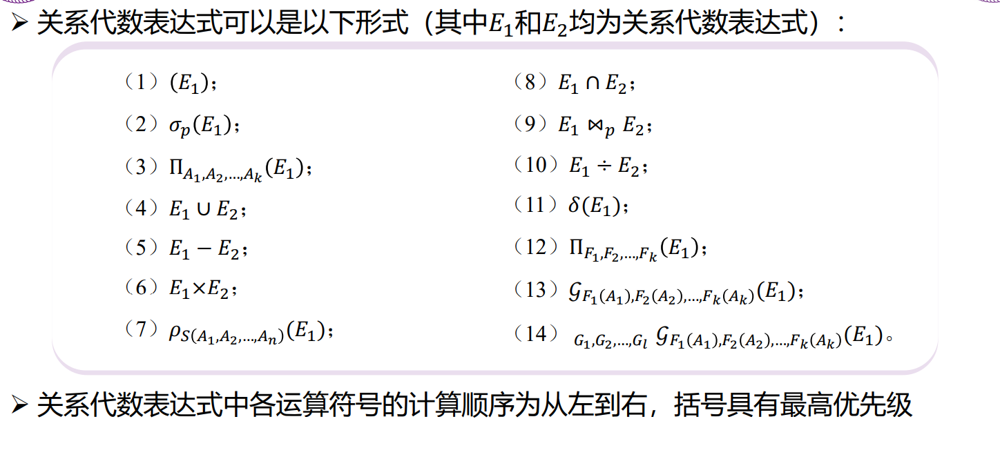

## 3

---

---

---

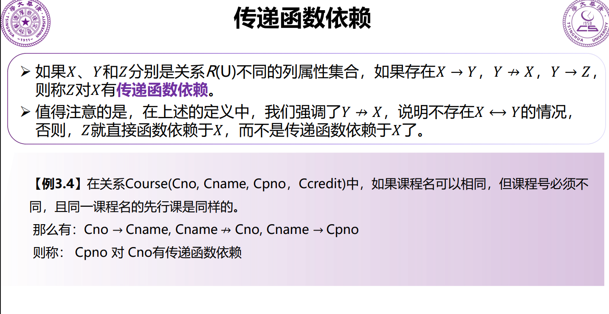

---

**多值依赖（Multivalued Dependency，MVD**指的是：**在一个关系中，某个属性确定后，另一组属性可以独立地取多个值，且彼此互不约束**。记作
A →→ B。

结合表中例子分析。关系模式可写成
R(Sno, Phone, Email)。

观察数据可知：

对同一个学号 Sno = 2021310721：
Phone 可以取 {137-XXXX-2271, 158-XXXX-1790}
Email 可以取 {[boli@tsinghua.edu.cn](mailto:boli@tsinghua.edu.cn), [libo@example.com](mailto:libo@example.com)}

关键点在于：
Phone 的取值与 Email 的取值 **相互独立**。
是否出现某个 (Phone, Email) 组合，只取决于“列举所有可能的笛卡尔积”，而不是业务约束。

因此存在以下多值依赖：
Sno →→ Phone
Sno →→ Email

但不存在函数依赖：
Sno ↛ Phone
Sno ↛ Email

因为 Sno 不能唯一决定一个 Phone 或一个 Email，只能决定“一个集合”。

这正是多值依赖的典型特征：
同一主属性下，两组多值属性彼此独立，却被强行放在一张表中，导致数据冗余（4 行只是 2×2 的组合结果）。

规范化含义：
该关系违反第四范式（4NF），应分解为：
R1(Sno, Phone)
R2(Sno, Email)

本例的本质不是“数据重复”，而是**独立多值被错误地做成了组合关系**。

---

平凡多值依赖与非平凡多值依赖的区分，核心只看**右边属性是否“没带来新信息”**。

平凡多值依赖：
设关系模式为 R，存在多值依赖
A →→ B
如果 **B ⊆ A**，或者 **A ∪ B = R**，则称为平凡多值依赖。
这类多值依赖在任何关系中天然成立，没有约束意义。

例子：
R(Sno, Phone, Email)

Sno →→ Sno
Sno →→ {Sno, Phone, Email}

这两种都是平凡多值依赖，因为右边要么已经包含在左边，要么直接等于整个关系。

非平凡多值依赖：
设关系模式为 R，存在多值依赖
A →→ B
如果 **B ⊄ A 且 A ∪ B ≠ R**，则称为非平凡多值依赖。
这类多值依赖反映了真实的业务语义，会导致冗余。

结合前面的学生例子：
R(Sno, Phone, Email)

Sno →→ Phone
Sno →→ Email

它们都是非平凡多值依赖，因为：
Phone 不包含在 Sno 中
Sno ∪ Phone ≠ {Sno, Phone, Email}

直观理解：
平凡多值依赖 = 结构上必然成立的废话
非平凡多值依赖 = 描述“某属性下存在相互独立的多值集合”，是违反 4NF 的根源

---

**连接依赖**（Join Dependency，JD）指的是：一个关系可以无损地分解为多个子关系，通过自然连接把这些子关系再连接起来，能够完全还原原关系，且这种可还原性本身就是一种约束。形式化表示为 JD⟨R1, R2, …, Rn⟩，含义是关系 R = R1 ⨝ R2 ⨝ … ⨝ Rn。最简单的连接依赖是二元的，而多值依赖本质上是特殊的三元连接依赖：A →→ B 等价于 JD⟨(A,B),(A,C)⟩，其中 C = R − A − B。连接依赖描述的是“必须通过多个投影再连接才能成立”的结构性约束，是第五范式（5NF）的核心概念；当一个关系中只存在由候选码蕴含的平凡连接依赖时，该关系满足第五范式。

---

**规范化**

---

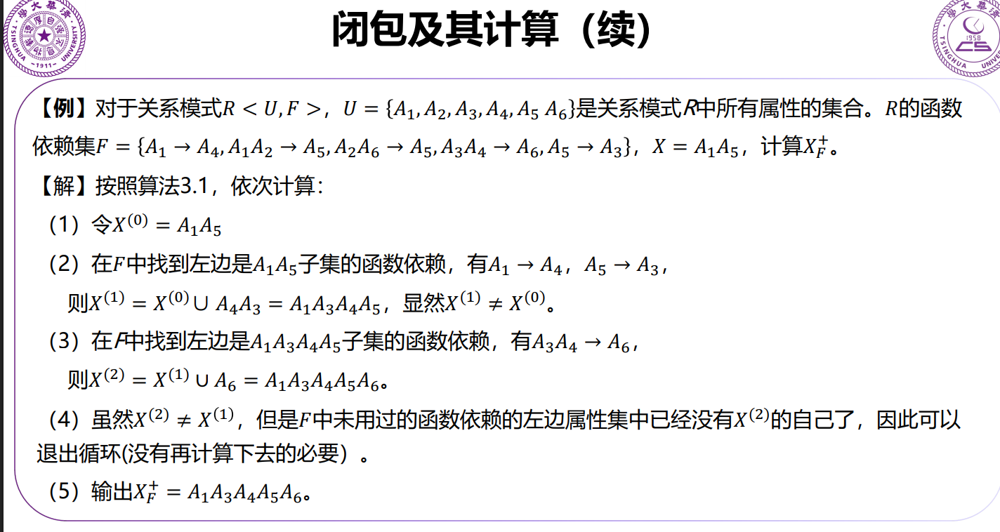

---

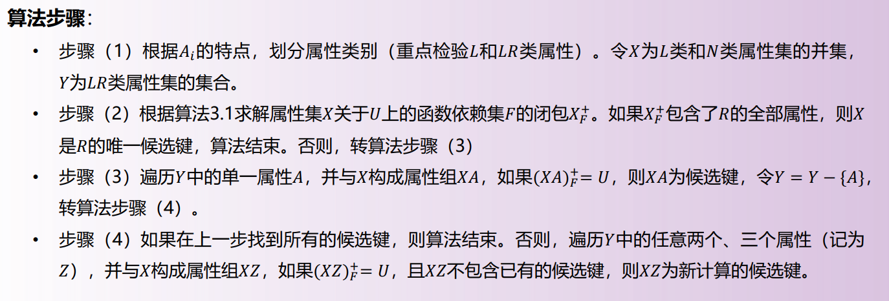

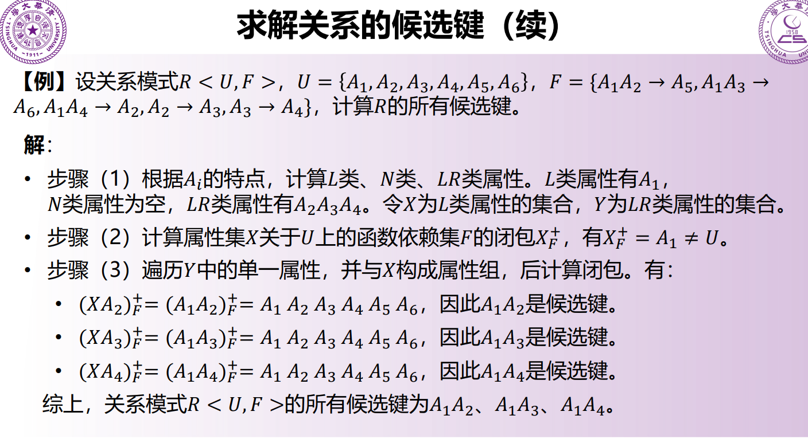

---

**最小函数依赖集**
* 右侧为单属性。
* 无多余函数依赖。
* 左侧无多余属性。
  
每一个函数依赖集必有对应的最小函数依赖集（不一定唯一）。

关系模式 R(A, B, C)，函数依赖集 F = { A → BC，B → C }。
先做右部原子化，得到 { A → B，A → C，B → C }。
检查左部冗余，所有依赖左部都只有一个属性，不存在可删属性。
检查冗余依赖：由 A → B 和 B → C 可推出 A → C，因此 A → C 是冗余的。
删除后得到最小函数依赖集 Fmin = { A → B，B → C }。

---

**无损连接分解**：把关系模式 R 分解为若干子模式后，用自然连接把它们重新连接，结果恰好等于原关系，不多不少。

形式化判定：将 R 分解为 R₁(X)、R₂(Y)，设公共属性集为 X∩Y。若在函数依赖集 F 下
(X∩Y) → X 或 (X∩Y) → Y
至少成立一个，则该分解是无损连接分解。

直观理解：公共属性必须能唯一确定其中一个子关系，否则连接时会产生伪元组。

简单例子：R(A,B,C)，F={A→B}，分解为 R₁(A,B) 和 R₂(A,C)。公共属性是 A，且 A→AB 成立，因此分解是无损的。
反例：R(A,B,C)，无任何依赖，分解为 R₁(A,B) 和 R₂(B,C)，公共属性 B 不能决定任一子模式，分解有损。

---

**分解的保持依赖性**：把关系模式 R 分解为 R₁, R₂, …, Rk 后，原来的每一条函数依赖都能仅在各子模式内部用投影后的依赖推导出来，而不需要再把子关系连接起来验证。

形式化说法：设 F 是 R 上的函数依赖集，Fi 是 F 在 Ri 上的投影，若
(F₁ ∪ F₂ ∪ … ∪ Fk)⁺ = F⁺
则该分解是保持依赖的。

直观理解：所有约束都能在“局部表”中直接检查，不用做连接。

简单例子：R(A,B,C)，F={A→B, B→C}，分解为 R₁(A,B) 和 R₂(B,C)。在 R₁ 中保留 A→B，在 R₂ 中保留 B→C，二者合起来可推出原 F，因此分解保持依赖。

反例：R(A,B,C)，F={A→BC}，分解为 R₁(A,B) 和 R₂(A,C)。投影后得到 A→B 和 A→C，但 A→BC 只能通过合并推导，单表无法直接检查，分解不保持依赖。

---

### 模式分解算法

？
* BCNF模式的函数依赖图中，箭头都是从候选码中引出，所有
不平凡FD的左边都是候选码。
* 分解到BCNF不一定能保持函数依赖。

---
**分解到3NF**

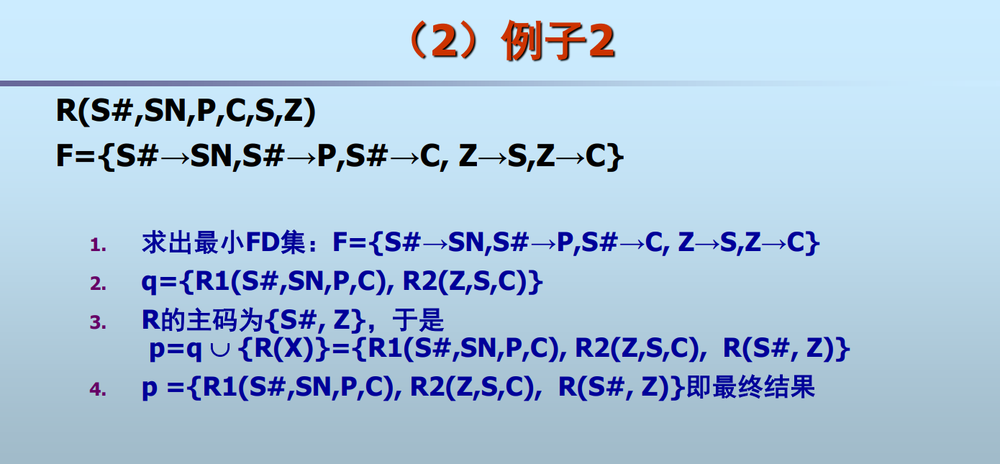

---
**分解到BCNF**

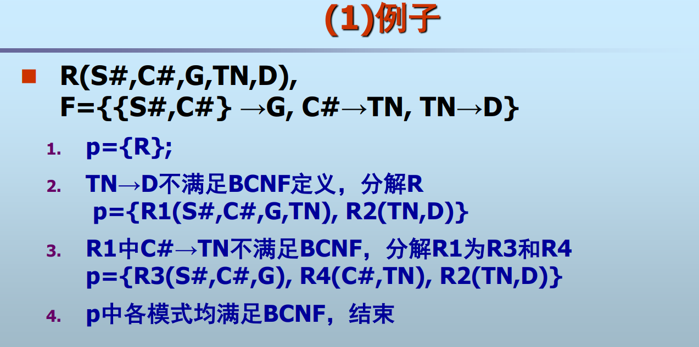

## 4

CASCADE 级联

---

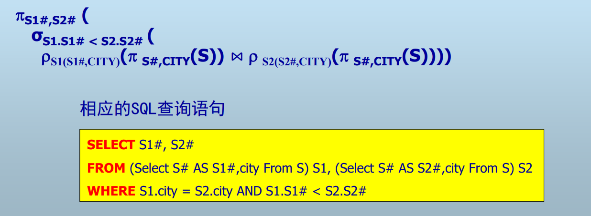

---

## 5.数据库存储

### 置换算法

**LRU**

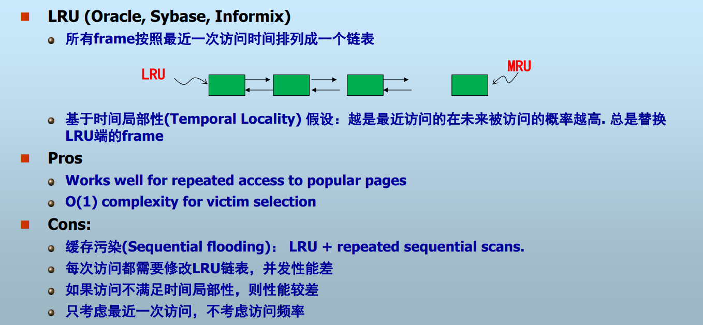

**LRU-K**

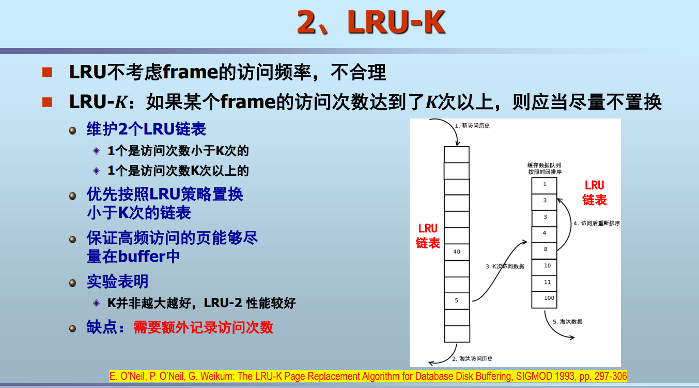

**2Q**：与LRU-2类似，不同之处在于访问1次的队列采用FIFO，
而不是LRU。

**CLOCK**

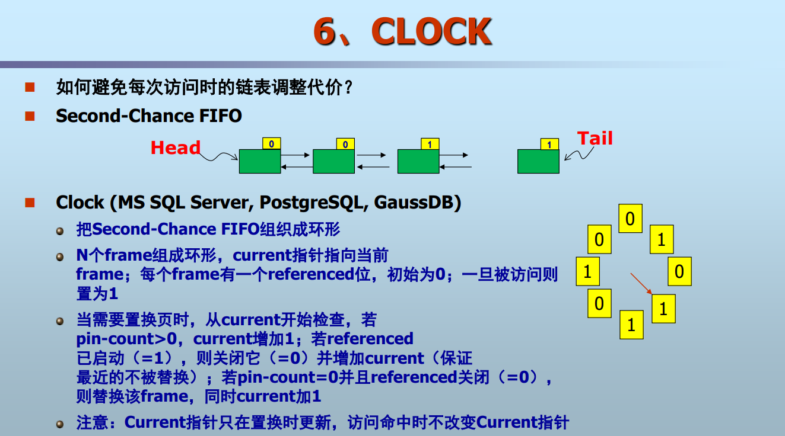

## 6.索引

### 顺序文件

**密集索引**

每个记录都有一个索引项

**稀疏索引**

一般情况：为每个数据块的第一个记录建立索引

**多级索引**

* 一级索引（密集）过大，二级索引（稀疏）可常驻内存。
* 一般不考虑三级以上（维护成本；B+树更好）。
* 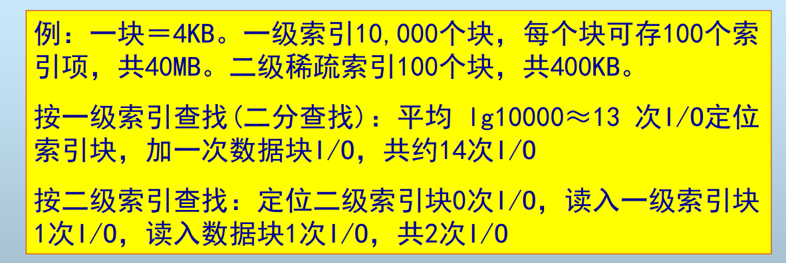

### 辅助索引

辅助索引（Secondary Index）是指**不决定数据物理存储顺序的索引**，用于加速非主键、非聚簇键上的查询。

核心特征：

* 不唯一，允许重复值。
* 不影响表中记录的物理排列。
* 索引项通常为：索引键值 + 指向数据行的指针（或主键值）。
* 一个表可以有多个辅助索引。

对比：

* 主索引 / 聚簇索引：决定数据存储顺序，通常只有一个。
* 辅助索引：仅提供访问路径，不决定顺序，可以有多个。

示例：
表 Student(id, name, age)，id 为主键。
在 name 上建立索引：name → id。
该索引即为辅助索引，用于加速按 name 查询。

**倒排索引**：记录->文档.

---

### B+树

内部节点：最少 m/2 个元素，最多m-1个元素。

任意节点：最多m个子指针。

---

### 散列表

给定一个查找键K，对应的记录必定位于桶h(K)中。

**可扩展散列表**＆**线性散列表**

可扩展散列表（Extendible Hashing）和线性散列表（Linear Hashing）都是**动态散列**，目标是在数据增长时避免整体重散列。

可扩展散列表
思想：用目录间接定位桶，通过增加哈希位数扩展。
结构：

* 目录：大小为 2^d，d 为全局深度。
* 桶：每个桶有本地深度 ld。
* 目录项指向桶，多个目录项可指向同一桶。
  操作机制：
* 插入导致桶满：若 ld < d，仅分裂桶；若 ld = d，目录倍增，d++，再分裂。
* 查找：按哈希值前 d 位查目录，再进桶。
  特点：
* 查找始终 O(1) 次磁盘访问。
* 目录可能很大，占内存。
* 结构规则、实现复杂。

线性散列表
思想：逐步、线性地分裂桶，不使用目录。
结构：

* 当前级别 i，对应哈希函数 h_i。
* 一个分裂指针 p，指示下一个要分裂的桶。
  操作机制：
* 插入时用 h_i 计算桶号；若桶号 < p，用 h_{i+1}。
* 桶溢出时：分裂 p 指向的桶，p++。
* 当 p 到达 2^i，令 p=0，i++。
  特点：
* 无目录，空间开销小。
* 扩展过程平滑，避免瞬时倍增成本。
* 查找可能多一次判断，但仍接近 O(1)。

对比要点

* 是否有目录：可扩展散列表有；线性散列表无。
* 扩展方式：可扩展为目录倍增；线性为逐桶分裂。
* 空间代价：可扩展高；线性低。
* 实现复杂度：可扩展高；线性中等。
* 查找稳定性：可扩展更稳定；线性略有波动。

一句话总结
可扩展散列表用空间换确定性访问；线性散列表用时间上的渐进分裂换空间效率。

## 7.查询优化

集合不允许重复值，包允许（数据库查询基于）。

---

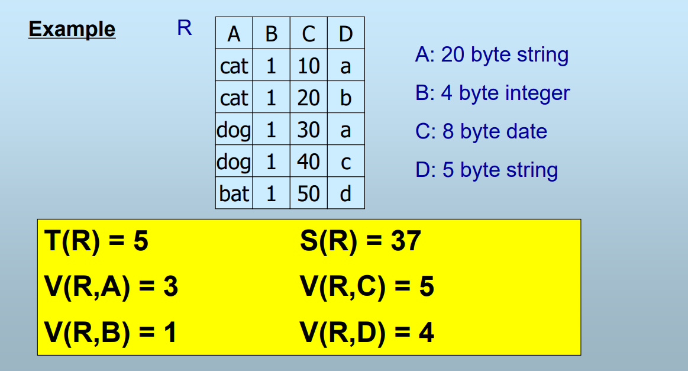

## 8.

## 9.日志

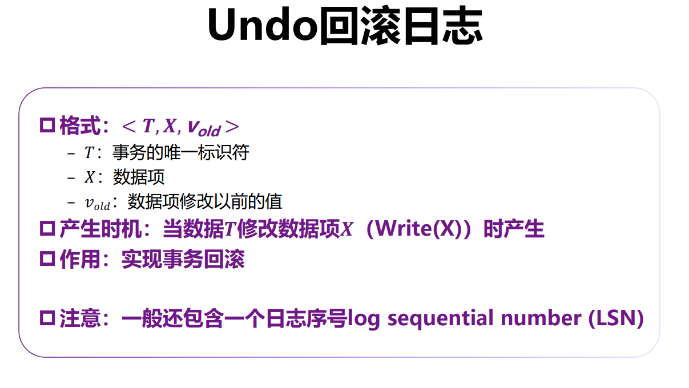

---

日志必须比数据更早的写入磁盘.

