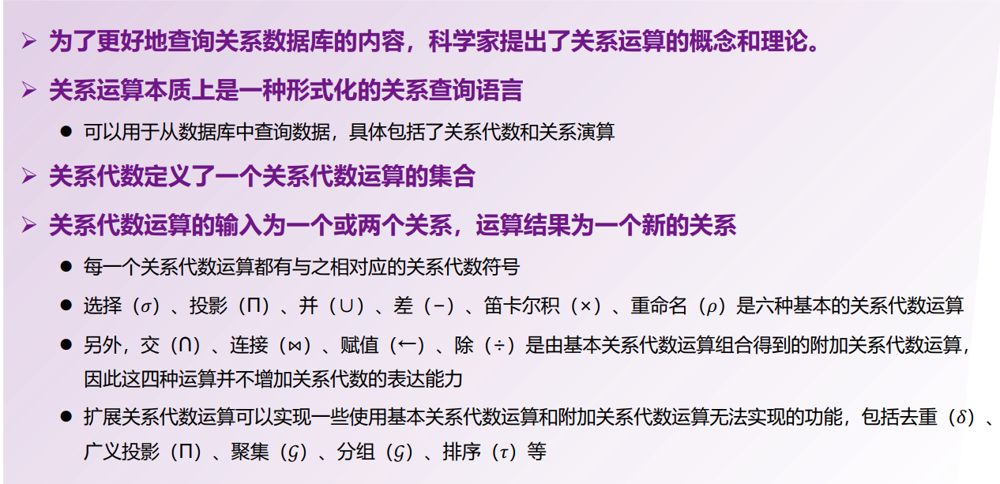
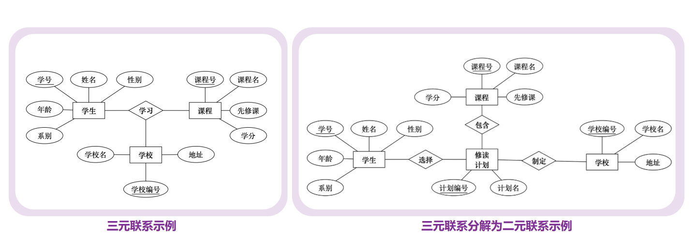
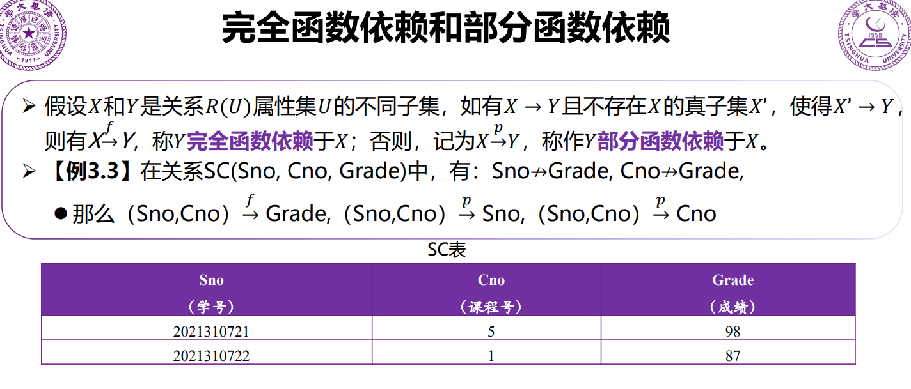
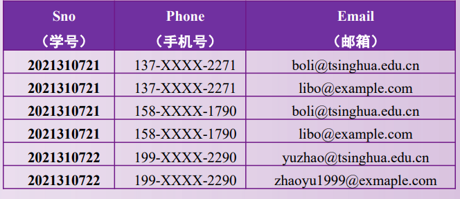
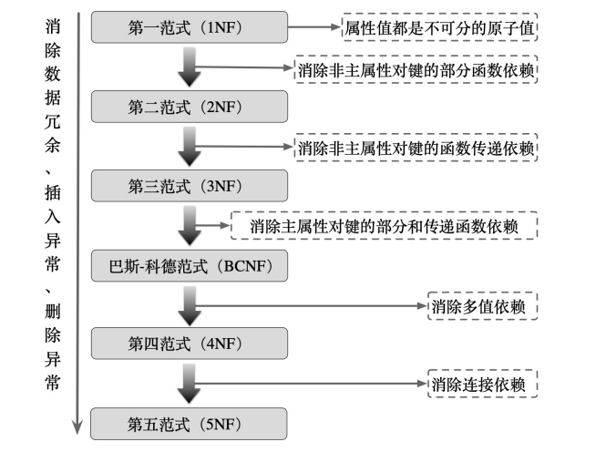

## 1
DBMS 是 **Database Management System**，中文叫**数据库管理系统**。
一句话：**它是用来创建、存储、查询和管理数据库的软件**。

比如 MySQL、Oracle、SQL Server，都属于 DBMS。它们负责把“数据的混乱堆放”变成“有秩序、可查询、可保护的数据世界”。

---
DDL 是 **Data Definition Language**，中文叫**数据定义语言**。
一句话：**它用来定义和修改数据库的结构，而不是数据本身**。

比如：

* `CREATE`：建表、建库
* `ALTER`：改表结构
* `DROP`：删表、删库

把数据库想成一栋房子，DDL 干的是画图纸、拆墙、加隔间的活，而不是往屋里搬家具。

---

---

DCL 是 **Data Control Language**，中文叫**数据控制语言**。
一句话：**它用来控制数据库中“谁能干什么”**。

典型操作只有两个主角：

* `GRANT`：授权
* `REVOKE`：收回权限

如果说 DDL 负责建房子，DML 负责往里放东西，那 DCL 就是发钥匙、定门禁，防止不该进的人乱逛数据库。

## 2

例子：学生表 Student(学号, 身份证号, 姓名)。

**超码（Super Key）**：能唯一标识一条记录的属性集合，可以包含多余属性。
{学号}、{身份证号}、{学号, 姓名} 都能唯一确定一个学生，因此它们都是超码。

**候选码（Candidate Key）**：最小的超码，去掉任何一个属性就不能唯一标识记录。一个表可以有多个候选码。
例子：在 Student 表中，{学号} 和 {身份证号} 都是候选码，因为它们各自已经可以唯一标识学生，且不能再简化。

**主码（Primary Key）**：从候选码中选定的一个，用作表中记录的主要标识。一个表只能有一个主码，且主码不能为 NULL。
例子：选择 {学号} 作为主码，则 Student(学号 PK, 身份证号, 姓名)。

一句话理解：超码是“能唯一就行”，候选码是“最小能唯一”，主码是“被选中的那个最小能唯一”。

---

## 3

---

---

---

---

**多值依赖（Multivalued Dependency，MVD**指的是：**在一个关系中，某个属性确定后，另一组属性可以独立地取多个值，且彼此互不约束**。记作
A →→ B。

结合表中例子分析。关系模式可写成
R(Sno, Phone, Email)。

观察数据可知：

对同一个学号 Sno = 2021310721：
Phone 可以取 {137-XXXX-2271, 158-XXXX-1790}
Email 可以取 {[boli@tsinghua.edu.cn](mailto:boli@tsinghua.edu.cn), [libo@example.com](mailto:libo@example.com)}

关键点在于：
Phone 的取值与 Email 的取值 **相互独立**。
是否出现某个 (Phone, Email) 组合，只取决于“列举所有可能的笛卡尔积”，而不是业务约束。

因此存在以下多值依赖：
Sno →→ Phone
Sno →→ Email

但不存在函数依赖：
Sno ↛ Phone
Sno ↛ Email

因为 Sno 不能唯一决定一个 Phone 或一个 Email，只能决定“一个集合”。

这正是多值依赖的典型特征：
同一主属性下，两组多值属性彼此独立，却被强行放在一张表中，导致数据冗余（4 行只是 2×2 的组合结果）。

规范化含义：
该关系违反第四范式（4NF），应分解为：
R1(Sno, Phone)
R2(Sno, Email)

本例的本质不是“数据重复”，而是**独立多值被错误地做成了组合关系**。

---

平凡多值依赖与非平凡多值依赖的区分，核心只看**右边属性是否“没带来新信息”**。

平凡多值依赖：
设关系模式为 R，存在多值依赖
A →→ B
如果 **B ⊆ A**，或者 **A ∪ B = R**，则称为平凡多值依赖。
这类多值依赖在任何关系中天然成立，没有约束意义。

例子：
R(Sno, Phone, Email)

Sno →→ Sno
Sno →→ {Sno, Phone, Email}

这两种都是平凡多值依赖，因为右边要么已经包含在左边，要么直接等于整个关系。

非平凡多值依赖：
设关系模式为 R，存在多值依赖
A →→ B
如果 **B ⊄ A 且 A ∪ B ≠ R**，则称为非平凡多值依赖。
这类多值依赖反映了真实的业务语义，会导致冗余。

结合前面的学生例子：
R(Sno, Phone, Email)

Sno →→ Phone
Sno →→ Email

它们都是非平凡多值依赖，因为：
Phone 不包含在 Sno 中
Sno ∪ Phone ≠ {Sno, Phone, Email}

直观理解：
平凡多值依赖 = 结构上必然成立的废话
非平凡多值依赖 = 描述“某属性下存在相互独立的多值集合”，是违反 4NF 的根源

---

**连接依赖**（Join Dependency，JD）指的是：一个关系可以无损地分解为多个子关系，通过自然连接把这些子关系再连接起来，能够完全还原原关系，且这种可还原性本身就是一种约束。形式化表示为 JD⟨R1, R2, …, Rn⟩，含义是关系 R = R1 ⨝ R2 ⨝ … ⨝ Rn。最简单的连接依赖是二元的，而多值依赖本质上是特殊的三元连接依赖：A →→ B 等价于 JD⟨(A,B),(A,C)⟩，其中 C = R − A − B。连接依赖描述的是“必须通过多个投影再连接才能成立”的结构性约束，是第五范式（5NF）的核心概念；当一个关系中只存在由候选码蕴含的平凡连接依赖时，该关系满足第五范式。

---

**规范化**

---

